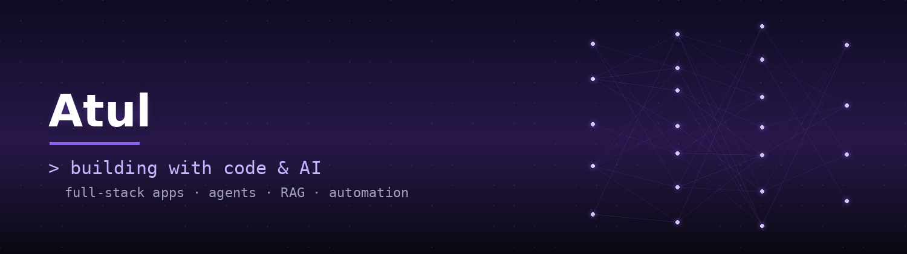

  

  
  

🚀 About Me

I'm drawn to the intersection of **software engineering and applied AI** — I like taking an idea from a blank repo to a real, working product. Most of what I build sits somewhere between full-stack apps and AI-powered tools: things like retrieval-augmented generation systems, agents that can use tools, and practical utilities that solve an actual problem rather than just demo one.

- 🧠 Into how LLMs, agents, and RAG pipelines actually work under the hood — not just using the APIs, but understanding the architecture
- 🏗️ Enjoy full-stack builds end-to-end: backend logic, databases, APIs, and shipping a deployed product
- 🔍 Like picking niche, practical problems over generic tutorial projects
- 📈 Always mid-way through learning something new and building with it immediately

 🛠️ Featured Projects

<table>
  <tr>
    <td width="50%" valign="top">
      <h4>💰 <a href="https://github.com/Atul-Singh-S/splitsquare">SplitSquare</a></h4>
      
A full-stack expense-splitting app with a debt-simplification algorithm that minimizes the number of transactions needed to settle group balances.

    </td>
    <td width="50%" valign="top">
      <h4>🔎 Project Name</h4>
      
One-line description of what it does and why it's interesting.

    </td>
  </tr>
  <tr>
    <td width="50%" valign="top">
      <h4>🤖 Project Name</h4>
      
One-line description of what it does and why it's interesting.

    </td>
    <td width="50%" valign="top">
      <h4>➕ More coming soon</h4>
      
Add another card here as you ship new projects.

    </td>
  </tr>
</table>

<!-- Simple alternative if you don't want the table layout:
- **[SplitSquare](https://github.com/YOUR_USERNAME/splitsquare)** — Full-stack expense splitter with a debt-simplification algorithm.
- **Project Name** — One-line description.
-->

 🧰 Tech Stack

  

<!-- Full icon list & names: https://skillicons.dev — just edit the i= param above -->

 📊 GitHub Stats

  

 📌 Currently Learning

- Agentic AI systems (ReAct, tool use, LangGraph)
- Full-stack deployment workflows (Vercel, Railway, Render)

